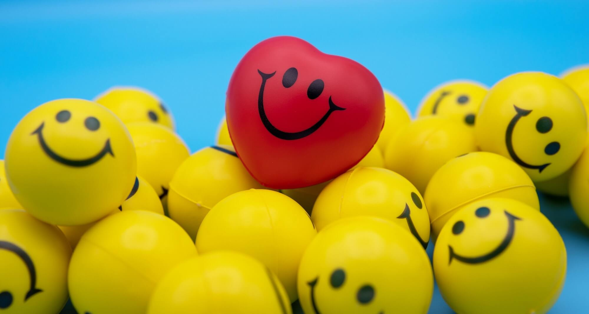

What causes happiness? This question has been the center of interdisciplinary research work for years. Psychologists, linguists, philosophers, and scientists have collaborated time and again, using several different approaches to take a crack at this elusive problem.




The age of the internet has brought about a revolution in terms of the sheer volume of data available for analysis, opening new avenues and spawning the branch of data science. 

To understand what makes people happy, an analysis of over 100,000 responses to the question “What made you happy in the last 24 hours?” was analyzed, and inferences were drawn based on the findings. The results are ‘interesting,’ to say the least, and it is remarkable how much simple sentences can reveal about the speaker's emotion, state of mind, and reasons behind emotions. We came across varied reasons for happiness, with clear trends seen across separate demographics.

```{r setup, include=FALSE}
knitr::opts_chunk$set(echo = FALSE, warning = FALSE, message = FALSE)
knitr::opts_knit$set(root.dir = "..")
```

```{r}
library(tm)
library(wordcloud2)
library(ggplot2)
library(tidyr)
library(ggraph)
library(concaveman)
library(BTM)
library(textplot)
library(udpipe)
library(igraph)
library(glasso)
library(qgraph)
```


```{r}
urlfile = 'https://raw.githubusercontent.com/megagonlabs/HappyDB/master/happydb/data/demographic.csv' # nolint
hm_metadata = read.csv(urlfile)
hm_data = read.csv("./output/processed_moments_subset.csv")
```

```{r}
hm = merge(hm_data, hm_metadata, by = "wid")
print(hm$original_hm[0:3])
```

```{r}
generate_wordcloud = function(df) {
    corpus = Corpus(VectorSource(df$text))
    dtm = TermDocumentMatrix(corpus)

    # Find the most frequent words
    freq_words = sort(rowSums(as.matrix(dtm)), decreasing = TRUE)
    df2 = data.frame(word = names(freq_words), freq = freq_words)
    top_words = head(df2, 5)

    # Print the top 5 most commonly used words
    set.seed(1234) # for reproducibility
    wordcloud2(data = df2, size = 0.40, color = "random-dark", shape = "circle")
    # return(top_words)
}

categorize_text = function(cleaned_text) {
    words_in_sentence = unlist(strsplit(cleaned_text, "\\s+"))
    if (length(words_in_sentence[words_in_sentence %in% entertainment_dict]) > 0) { # nolint: line_length_linter.
        return("entertainment")
    } else if (length(words_in_sentence[words_in_sentence %in% exercise_dict]) > 0) { # nolint: line_length_linter.
        return("exercise")
    } else if (length(words_in_sentence[words_in_sentence %in% family_dict]) > 0) { # nolint: line_length_linter.
        return("family")
    } else if (length(words_in_sentence[words_in_sentence %in% food_dict]) > 0) { # nolint: line_length_linter.
        return("food")
    } else if (length(words_in_sentence[words_in_sentence %in% people_dict]) > 0) { # nolint: line_length_linter.
        return("people")
    } else if (length(words_in_sentence[words_in_sentence %in% pets_dict]) > 0) { # nolint: line_length_linter.
        return("pets")
    } else if (length(words_in_sentence[words_in_sentence %in% school_dict]) > 0) { # nolint: line_length_linter.
        return("school")
    } else if (length(words_in_sentence[words_in_sentence %in% shopping_dict]) > 0) { # nolint: line_length_linter.
        return("shopping")
    } else if (length(words_in_sentence[words_in_sentence %in% work_dict]) > 0) { # nolint: line_length_linter.
        return("work")
    } else {
        return("unknown")
    }
}
```

## A visual view of which category makes people most happy on a daily basis

In the first visualization, we can see that the most common reason for happiness among all the people was leisure time and activities related to spending that leisure time with either family or on hobbies. Another interesting observation is the reason of romantic interest, as evidenced by the words "love," "boyfriend," and "girlfriend." This indicates that humans are simple beings at their core who like spending time with family, pursuing love interests, or trying out hobbies. Despite the complexities of psychology and emotions, some things stay the same after all.

```{r}
ggplot(hm_data, aes(x = predicted_category, fill = predicted_category)) +
  geom_bar() +
  labs(x = "Theme", y = "Frequency", title = "Frequency of general theme") + # nolint 
  scale_fill_manual(values = c("yellow",  "#fff700",  "#ffd000",  "#ffc400",  "#ffd500",  "#ffcc00",  "#ffa200"))
```

Coming over to specific categories of the sources of happiness, achievement, and affection dominate the landscape, conforming with the word cloud inference of romantic interest, family, and work being the best predictors of happiness. The general theme, however, deviates slightly from our prior observations, and family again stands out on top; entertainment takes the second spot (since people are essentially family or friends), but work gets relegated to a very low rank.

```{r}
# Load the dictionaries into data frames
entertainment_dict = readLines("https://raw.githubusercontent.com/megagonlabs/HappyDB/master/happydb/data/topic_dict/entertainment-dict.csv") # nolint: line_length_linter.
exercise_dict = readLines("https://raw.githubusercontent.com/megagonlabs/HappyDB/master/happydb/data/topic_dict/exercise-dict.csv") # nolint: line_length_linter.
family_dict = readLines("https://raw.githubusercontent.com/megagonlabs/HappyDB/master/happydb/data/topic_dict/family-dict.csv") # nolint: line_length_linter.
food_dict = readLines("https://raw.githubusercontent.com/megagonlabs/HappyDB/master/happydb/data/topic_dict/food-dict.csv") # nolint: line_length_linter.
people_dict = readLines("https://raw.githubusercontent.com/megagonlabs/HappyDB/master/happydb/data/topic_dict/people-dict.csv") # nolint: line_length_linter.
pets_dict = readLines("https://raw.githubusercontent.com/megagonlabs/HappyDB/master/happydb/data/topic_dict/pets-dict.csv") # nolint: line_length_linter.
school_dict = readLines("https://raw.githubusercontent.com/megagonlabs/HappyDB/master/happydb/data/topic_dict/school-dict.csv") # nolint: line_length_linter.
shopping_dict = readLines("https://raw.githubusercontent.com/megagonlabs/HappyDB/master/happydb/data/topic_dict/shopping-dict.csv") # nolint: line_length_linter.
work_dict = readLines("https://raw.githubusercontent.com/megagonlabs/HappyDB/master/happydb/data/topic_dict/work-dict.csv") # nolint: line_length_linter.

hm_data$label = sapply(hm_data$text, categorize_text)

hm = merge(hm_data, hm_metadata, by = "wid")

hm_subset = subset(hm, label != "unknown")

ggplot(hm_subset, aes(x = label, fill = label)) +
  geom_bar() +
  labs(x = "Category", y = "Frequency", title = "Category-wise distribution") + # nolint
  scale_fill_manual(values = c("yellow",  "#fff700",  "#ffd000",  "#ffc400",  "#ffd500",  "#ffcc00",  "#ffa200", "#ffb700", "#ffd900"))
```

## Gender-wise distribution

However, it would be much more interesting to see how various demographics shift in terms of their main reasons for happiness. Observing the data for men and women separately, we saw that despite minor differences, the word clouds were similar overall, and the greatest sources of happiness were related to free time, friends, and family, reinforcing the overall narrative of leisure providing pleasure. An interesting outlier to this was work, which seems evident in this day and age, where success at work largely dictates overall happiness outside work as well.

```{r}

hm_subset %>%
  ggplot() +
  aes(x = label, fill = gender) +
  geom_bar(width = 0.6) +
  scale_fill_brewer(palette = "Paired") +
  labs(title = "Gender-wise distribution of which category makes people happy") +
  coord_flip() +
  theme_minimal()

male_data = subset(hm, gender == "m")
female_data = subset(hm, gender == "f")

generate_wordcloud(male_data)
generate_wordcloud(female_data)
```

## Marital status-wise distribution

Marital status provides a starker contrast, with single people tending to rank words like “friends,” “restaurant,” “party,” “game,” and “money” highly, and married people ranking words like “husband,” “wife,” “son,” “daughter,” “birthday,” and “dinner” pretty high. This is consistent with real-life experience as well since marriage typically indicates a high degree of devotion toward family. At the same time, a single person may be expected to be more interested in going out, meeting friends, and having a good time.

```{r}

hm_subset %>%
  ggplot() +
  aes(x = label, fill = marital) +
  geom_bar(width = 0.6) +
  scale_fill_brewer(palette = "Paired") +
  labs(title = "Marital status-wise distribution of which category makes people happy") +
  coord_flip() +
  theme_minimal()

single_data = subset(hm, marital == "single")
married_data = subset(hm, marital == "married")

generate_wordcloud(single_data)
generate_wordcloud(married_data)
```

## Age-wise distribution

Going through the spectrum of age groups, we see a shift from a focus on “work,” “money,” “friends,” and “money” among people younger than 30 years to a focus on “work,” “time,” “family,” “son,” and “kids.” Among the age group of people older than 50 years, we see interesting terms crop up associated with an older demographic, such as “granddaughter,” “grandson,” and “grandchildren.” The passage of time shifts priorities for everyone, and that has been exemplified perfectly by the word clouds for different age groups.


```{r}
less_than_30_data = subset(hm, age <= 30)
more_than_30_data = subset(hm, age > 30)
between_30_50_data = subset(more_than_30_data, age <= 50)
more_than_50_data = subset(hm, age > 50)

generate_wordcloud(less_than_30_data)
generate_wordcloud(between_30_50_data)
generate_wordcloud(more_than_50_data)
```

## Analyzing similarity between word-groups

Analysis of similarities between word groups is also performed, with the strongest correlations corresponding to thicker lines joining the words. This leads us to some insightful conclusions, such as the relationship between “moment,” “life,” and “happiness,” the equivalence of “food,” “beautiful,” and “feel,” and the proximity between “home,” “play,” and “game.” It is fascinating to see these and other relations and link them with personal experiences to realize how universal some stimuli and feelings are.

```{r}
hm_data_split = hm_data %>%
  separate_rows(text, sep = " ")

x = document_term_frequencies(hm_data_split, document = "hmid", term = "text")
dtm = document_term_matrix(x)
# dtm = dtm_remove_lowfreq(dtm, maxterms = 50)
dtm = dtm_remove_sparseterms(dtm, sparsity = 0.99)

m = dtm_cor(dtm)

textplot_correlation_glasso(m, exclude_zero = TRUE)
```

Finally, we see that “time,” “work,” “friends,” and “family” are among the most frequently occurring words in the entire corpus, reiterating our inferences and lending credence to the hypotheses at the start of our analysis.

```{r}
corpus = Corpus(VectorSource(hm_data$text))

# Create a Document Term Matrix (DTM)
dtm = TermDocumentMatrix(corpus)

# Find the most frequent words
freq_words = sort(rowSums(as.matrix(dtm)), decreasing = FALSE)

textplot_bar(tail(freq_words, 20), panel = "Words", col.panel = "yellow", xlab = "Words", cextext = 0.75, addpct = TRUE, cexpct = 0.5) # nolint

```

## Conclusion

In conclusion, these visualizations provide a uniquely beautiful perspective into the human psyche, showing us the things that provide immense joy and how various stimuli are interlinked. As we go through the various stages of human life through our visualizations, we see how perspectives change and mature to highlight different facets, from friends to spouses and children to finally grandkids, thus completing the circle of life.